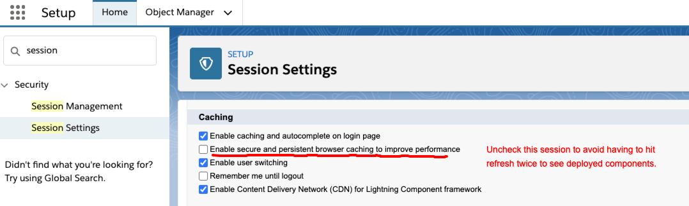

# Cactusforce 2021 Preview - Developer Track

## Developing Lightning Web Components

The track is designed for people familiar with Salesforce development who are interested in getting started with the basics of Lightning Web Components (LWCs).  

Topics covered are:

* Viewing Components in the Local Development Server
* Inter Component Communication through attributes and events
* Embedding Components inside other components
* Invoking Apex from an LWC to query data

### Additional Resources
* [LWC Reference](https://developer.salesforce.com/docs/component-library/overview/components)
* [Sample Gallery](https://trailhead.salesforce.com/sample-gallery)
* [Your Local Dev Server](http://localhost:3333)
* [Lifecycle Hooks](https://developer.salesforce.com/docs/component-library/documentation/en/lwc/lwc.reference_lifecycle_hooks)

### Session Settings to avoid 2x Refresh

### TODO
* Link session recording.

